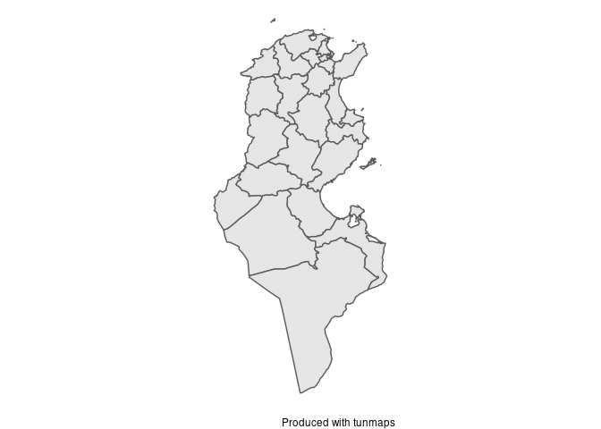
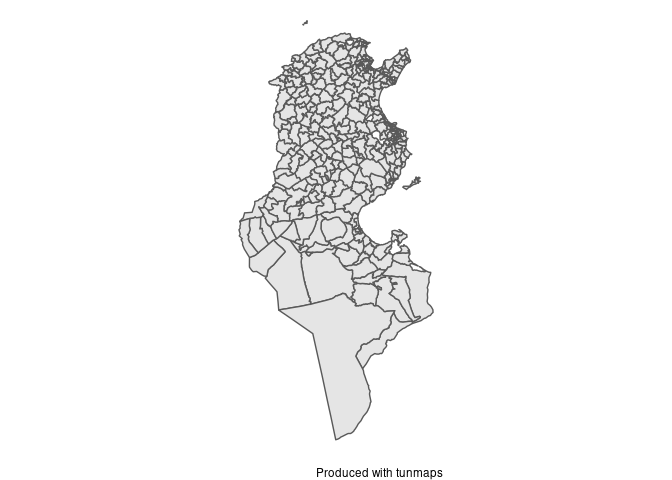

<!-- README.md is generated from README.Rmd. Please edit that file -->

# tunmaps

<!-- badges: start -->
<!-- badges: end -->

tunmaps provides an easy access to R users who wish to plot data on maps
of Tunisia with various administrative levels.

## Installation

You can install the development version of tunmaps from
[GitHub](https://github.com/) with:

``` r
# install.packages("devtools")
devtools::install_github("iyedg/tunmaps")
```

## Example

This is a basic example which shows you how to solve a common problem:

``` r
library(tunmaps)
plot_governorates()
```



``` r
library(tunmaps)
plot_municipalities()
```



## Reference resources

-   [OECD](https://www.oecd-ilibrary.org/sites/8b6103e3-fr/index.html?itemId=/content/component/8b6103e3-fr)

-   [INS](http://ins.tn/sites/default/files/publication/pdf/code%20geographique%202012_0.pdf)

-   [CGDR](http://cgdr.nat.tn/upload/files/15.pdf)

-   <https://dickoa.gitlab.io/rgeoboundaries/>
